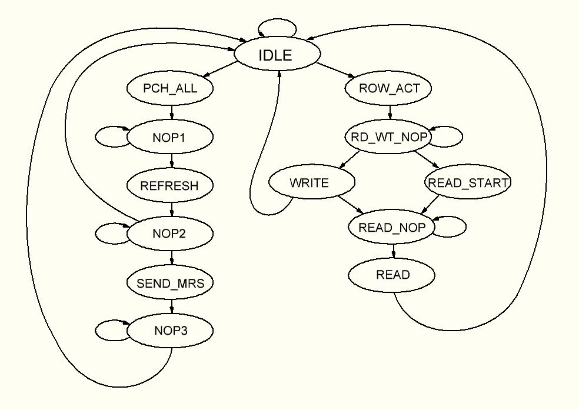
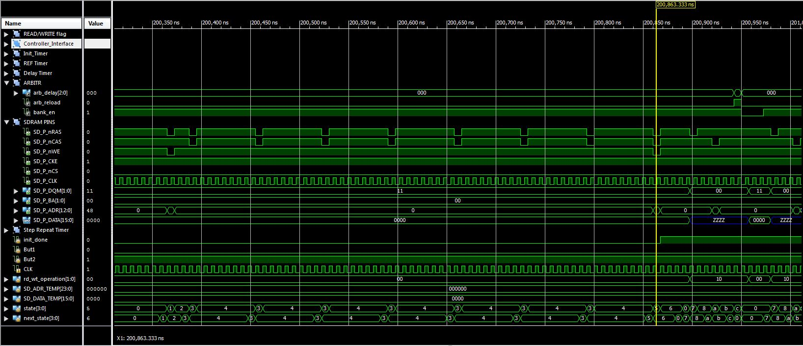
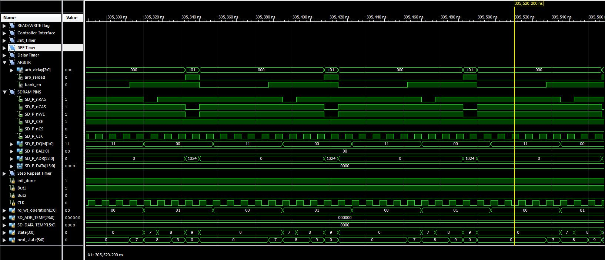
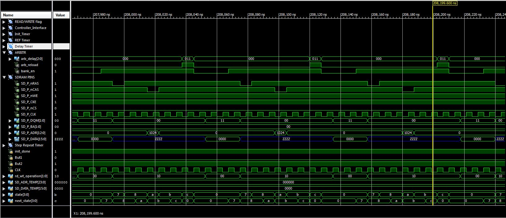

# SDRAM_Controller
SDR SDRAM controller for Xilinx and Lattice FPGA  
Language: Verilog  
Project tested with board Alinx AX309 based on Spartan 6 and custom board based on Lattice MachXO2  

FSM:

Initialization time diagram:

Write time diagram:

Read time diagram:

